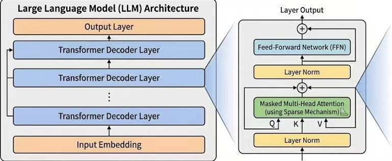

# CS441 Trainable Sparse Attention - Project Summary

## 🎯 Project Overview
Sparse attention is a promising method to reduce the cost during the LLM inference. DeepSeek's native sparse attention is a pretraining method that enables the model to select a subset of KV cache during the inference time, as shown in the follwing figure. In this project, I'd like to show a proof of concept that a GPT-like transformer can be pretrained  to have sparse attention ability.

<div align="center">
  
</div>

> NOTE: I tried to fine-tune the Llama 3.2-1B to enable sparse attention.
> I tried a lot of efforts to distill the full attention knowledge to sparse attention. But it cannot work well because the fine tuning was not stable.
> I think the reason is due to a small batch size to be within the memory limit of NVIDIA L40.
> That's why I decided to train a transformer from scratch as a proof of concept.
### 🔧 Environment Setup


```bash
conda create -n sparse-attn python=3.10 -y
conda activate sparse-attn
pip install -r requirements.txt
```

### Folder structure

- **pretrain/**: Pretrain a small GPT-like Transformer on enwik8 (byte-level LM).
  - `train.py`: main training script (edit `SEQ_LEN`, `USE_SPARSE_ATTN`, `COMPRESS_METHOD`, etc.)
  - `data/enwik8.gz`: training data (byte stream)
  - `ckpt/`: saved checkpoints
  - `wandb/`: W&B logs

- **sparse_attention/**: Sparse attention related code.
  - `native_sparse_attention_pytorch/`: in-repo copy of DeepSeek Native Sparse Attention (NSA)
    - includes `Transformer`, `SparseAttention`, and `compress_networks.py`
  - additional model wrappers used in this project (e.g., Llama + adapters experiments)

- **evaluation/**: Evaluation scripts (efficiency + quality).
  - `efficiency.py`: latency / throughput / peak memory test
  - `perplexity.py`: PPL test (in-distribution vs out-of-distribution)
  - `pretrain/run_pretrain_efficiency_test.sh`: wrapper to compare checkpoints
  - `pretrain/run_pretrain_ppl_test.sh`: wrapper to compare checkpoints

- **data_collection/**: CS441 QA data (synthetic train/test) used as OOD evaluation source.

- **continuous_pretrain/**: (planned) “middle training / continuous pretraining” on CS441 dataset.

- **fine_tune/**: (to make it work,ignore now) Llama fine-tuning experiments; requires multi-gpus.

### launch scripts

#### pretraining

Pretrain from scratch on enwik8:

```bash
cd pretrain
python train.py
```

Key knobs in `pretrain/train.py`:

- **Attention type**
  - `USE_SPARSE_ATTN = True`: train with NSA sparse attention
  - `USE_SPARSE_ATTN = False`: train a full-attention baseline
- **Sequence length / batch size**: `SEQ_LEN`, `BATCH_SIZE`
- **Compression method (NSA)**
  - `COMPRESS_METHOD = 'conv' | 'attn' | 'mlp' | 'mean'`

#### evaluation

This repo provides two evaluation dimensions:

- **Efficiency (speed + memory)**:

```bash
# from repo root
bash evaluation/pretrain/run_pretrain_efficiency_test.sh 5000
```

It loads checkpoints under `pretrain/ckpt/` and prints latency / throughput / peak memory.

- **Quality (perplexity, ID vs OOD)**:

```bash
# from repo root
bash evaluation/pretrain/run_pretrain_ppl_test.sh 5000 512
```

It evaluates:
- **In-distribution**: enwik8 validation split (byte-level)
- **Out-of-distribution**: CS441 synthetic QA test set, serialized to UTF-8 bytes

## 📁 Project Structure

### data collection
I collected some QA-style notes from UIUC CS441 while preparing for the exam. To scale up the data, I designed prompts to let Gemini generate additional synthetic data in a question–answer format. See [`data_collection/readme.md`](data_collection/readme.md).

#### Usage in prertaining
I pretrained the Transformer on **enwik8** as a byte-level language modeling task.


#### Usage in continuous-pretraining(aka middle training)
I planned to run a second-stage “continuous pretraining” on the CS441 dataset after enwik8 pretraining. Due to time/compute constraints it was not fully executed, but the dataset is still useful as an **OOD evaluation** source.

#### Usage in evaluation
During evaluation:
- **In-distribution**: a subset of enwik8 validation (byte-level)
- **Out-of-distribution**: CS441 synthetic QA test set (converted to a byte stream)

### Model design
<div align="center">
  
</div>

The original [Native Sparse Attention (NSA)](https://arxiv.org/pdf/2502.11089) from DeepSeek has three components:
1. **Compression module** for global information (compress long KV into fewer “memory” slots)
2. **Fine-grained block selection** for mid-range information (select a few important remote blocks)
3. **Sliding window attention** for local information

The outputs of all three branches are combined by a learned gate to form the final attention output.

The compression module is critical: it provides global context and also drives fine-grained selection. The original NSA paper uses an MLP-style compressor, while MoBA suggests simple mean pooling can already work surprisingly well.

Therefore, I implemented and compared four compression methods (see `sparse_attention/native_sparse_attention_pytorch/compress_networks.py`):

- **`ConvLinearCompress` (`conv`)**: grouped 1D convolution per head (learned downsampling).
- **`AttentionPool` (`attn`)**: attention-based pooling inside each window (learned weighted average).
- **`MeanPoolCompress` (`mean`)**: parameter-free mean pooling baseline.
- **`GroupedMLP` (`mlp`)**: per-head MLP over the flattened window (higher capacity, higher cost).


### Evaluation

Different compression modules and max context length
#### pretraining time observation
- training loss and evaluation loss (enwik8 val)

#### Efficiency
- metrics: peak memory, latency, throughput

#### Quality
- metrics: Perplexity in in-distribution and out-of-distribution case (enwik8 vs CS441)


## 📝 Citation

If you use this code, please cite:

```bibtex
@misc{cs441_sparse_attention,
  title={Pretrain transformer(LLM) with sparse attention},
  author={Jinwei Yao},
  year={2025},
  
}
```

## Acknowledge


